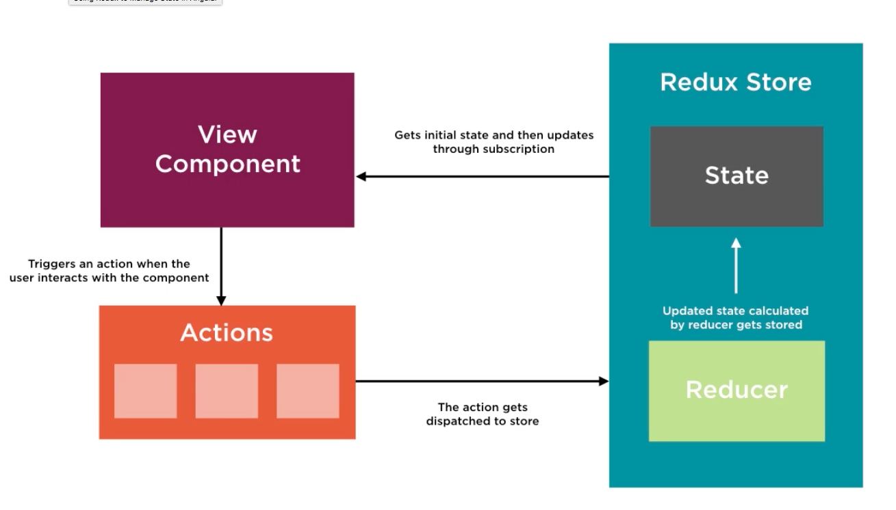

# Overview

This is redux at its very basic. 

# Redus principles

1. Single source of truth
1. State is read only
1. Pure functions drive state changes

# The redux architecture
This shows the redux architecture 

The usage of each of these components can be found commented in the code.